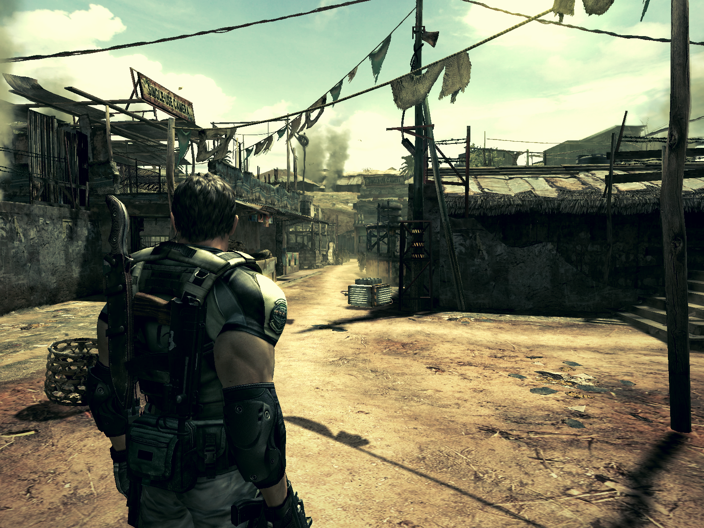

Field of view patch/mod for Vanilla Resident Evil 5 v1.0

### Install
- Go to your game installation directory
- Rename your existing xinput1_3.dll to xinput1_3_orig.dll
  - (If you do not have xinput1_3.dll, copy it from C:\WINDOWS\System32 into your game directory)
- Rename patch.dll to xinput1_3.dll and put it into your game directory
- Copy fov.ini into your game directory and edit this file with your desired FOV

### Usage
- In the game press the back button to toggle between original and patch

Original                   |  Patch (FOV 60)
:-------------------------:|:-------------------------:
  |  

Original                   |  Patch (FOV 60)
:-------------------------:|:-------------------------:
  |  
